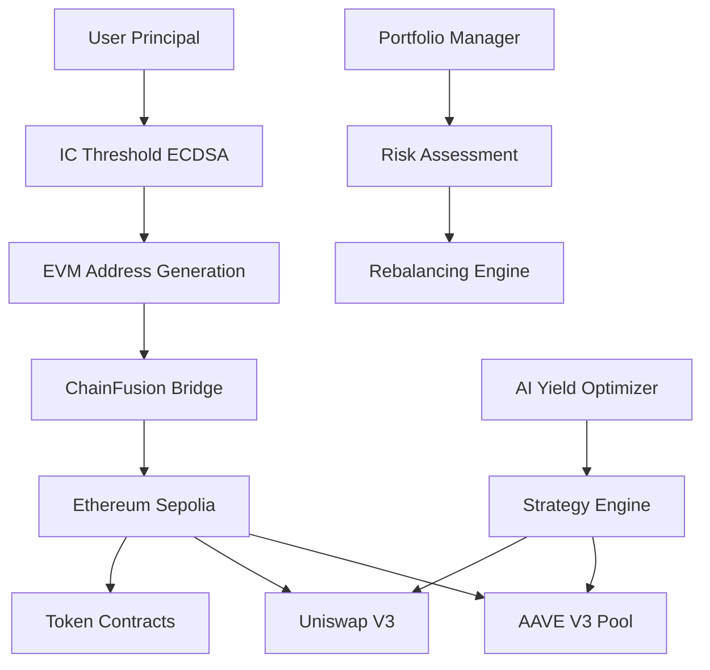

<div align="center">

# 🌟 Yieldex IC Wallet Manager

**The Next-Generation Cross-Chain DeFi Wallet Powered by Internet Computer**

[](https://www.rust-lang.org/)
[](https://internetcomputer.org/)
[](https://defillama.com/)
[](https://aave.com/)

*Revolutionizing DeFi with AI-powered cross-chain yield optimization through Internet Computer's ChainFusion technology*

[🚀 **Live Demo**](https://a4gq6-oaaaa-aaaab-qaa4q-cai.raw.icp0.io/?id=lla3p-uyaaa-aaaap-an2ea-cai) • [🧪 **Try It Now**](https://github.com/YieldexAI/yieldex-ic-wallet-manager?tab=readme-ov-file#-quick-start-guide)

</div>

---

## 🎯 **What is Yieldex?**

Yieldex IC Wallet Manager is a **groundbreaking Rust-based Internet Computer canister** that brings institutional-grade DeFi operations to everyone. Built on IC's revolutionary **ChainFusion** technology, it enables seamless cross-chain interactions without bridges, private key management, or centralized intermediaries.

### 🌈 **Why Yieldex?**

| Traditional DeFi            | 🆚   | Yieldex IC Wallet Manager                        |
| --------------------------- | ---- | ------------------------------------------------ |
| 🔐 Manage private keys      | ➡️ | 🛡️**Threshold ECDSA** (No keys to lose!) |
| 🌉 Trust bridges            | ➡️ | ⚡**Native ChainFusion**                   |
| 📊 Manual yield farming     | ➡️ | 🤖**AI-Powered Optimization**              |
| 💸 High gas fees            | ➡️ | 💰**Optimized Nonce Management**           |
| 🔒 Single-chain limitations | ➡️ | 🌐**True Cross-Chain Freedom**             |

---

## ✨ **Cutting-Edge Features**

### 🏦 **Smart Wallet Infrastructure**

- 🔑 **Zero-Knowledge Address Generation** - Unique EVM addresses via IC threshold ECDSA
- 👤 **Principal-Based Identity** - Seamless user verification and management
- 🛡️ **Advanced Permissions System** - Granular control over protocols and token operations
- 📈 **Real-Time Portfolio Tracking** - Monitor all your DeFi positions in one place

### 💰 **Multi-Token Universe**

- **ETH** - Native Ethereum support with optimized gas management
- **USDC** - Stablecoin operations with 6-decimal precision
- **LINK** - Chainlink token integration for oracle-powered DeFi
- **WETH** - Wrapped ETH for DeFi protocol compatibility

### 🏛️ **DeFi Protocol Integration**

- 🏪 **AAVE V3** - Supply, withdraw, and earn yield on Sepolia testnet ✅ **LIVE**
- 🏗️ **Compound III** - Supply and withdraw USDC on Arbitrum One mainnet ✅ **LIVE**
- 🔄 **Cross-Protocol Rebalancing** - Automated token migration between AAVE and Compound ✅ **LIVE**
- 🦄 **Uniswap V3** - Automated market making and token swaps *(coming soon)*

### 🔐 **Enterprise-Grade Security**

- 🎯 **Threshold Cryptography** - Distributed key management with no single point of failure
- 🛡️ **Access Control Matrix** - Role-based permissions with daily limits
- 📊 **Transaction Monitoring** - Real-time security checks and anomaly detection
- 🔍 **Audit Trail** - Complete transaction history and compliance tracking

---

## 🏗️ **Technical Architecture**



<details>
<summary>📁 <strong>Project Structure</strong></summary>

```
yieldex-ic-wallet-manager/
├── 🚀 src/
│   └── yieldex-ic-wallet-manager-backend/
│       ├── src/
│       │   ├── 🛠️ services/                  # Modular service architecture
│       │   │   ├── 🏦 aave.rs                # AAVE V3 integration
│       │   │   ├── 💰 get_balance_*.rs       # Multi-token balance checking
│       │   │   ├── 📤 transfer_*.rs          # Token transfer operations
│       │   │   ├── ✅ approve_*.rs           # Token approval management
│       │   │   ├── 🔄 wrap_eth.rs            # ETH/WETH wrapping
│       │   │   ├── ✍️ sign_message.rs        # Message signing utilities
│       │   │   └── 🔐 permissions.rs         # Access control system
│       │   ├── 📄 abi/                       # Smart contract ABIs
│       │   │   ├── AAVE_Pool.json
│       │   │   ├── LINK.json
│       │   │   ├── USDC.json
│       │   │   └── WETH.json
│       │   └── 🧠 lib.rs                     # Core canister logic
│       └── ⚙️ Cargo.toml
├── 🧪 tests/                                 # Comprehensive test suite
├── 📚 project_docs/                          # Technical documentation
└── 🔧 dfx.json                              # IC deployment config
```

</details>

---

## 🚀 **Quick Start Guide**

### 🛠️ **Prerequisites**

Ensure you have these tools installed:

```bash
# Install Rust (latest stable)
curl --proto '=https' --tlsv1.2 -sSf https://sh.rustup.rs | sh

# Install DFX SDK (latest version)
sh -ci "$(curl -fsSL https://internetcomputer.org/install.sh)"

# Install PocketIC for testing
# Follow: https://github.com/dfinity/ic/tree/master/packages/pocket-ic
```

### ⚡ **Lightning-Fast Setup**

```bash
# 1️⃣ Clone the revolutionary codebase
git clone https://github.com/your-org/yieldex-ic-wallet-manager.git
cd yieldex-ic-wallet-manager

# 2️⃣ Fire up the IC local replica
dfx start --background

# 3️⃣ Build the cutting-edge canister
dfx build

# 4️⃣ Deploy locally for testing
dfx deploy

# 🎉 Ready to revolutionize DeFi!
```

### 🌐 **Deploy to IC Mainnet**

```bash
# Deploy to the decentralized cloud
dfx deploy --network ic
```

---

## 🎮 **Interactive API Playground**

### 🏦 **Wallet Management**

<details>
<summary>🔑 <strong>Generate Your Quantum-Secure EVM Address</strong></summary>

```bash
# ✨ Create your unique EVM address using IC threshold ECDSA
dfx canister call yieldex-ic-wallet-manager-backend generate_evm_address --ic   

# 📋 Retrieve your stored address
dfx canister call yieldex-ic-wallet-manager-backend get_evm_address --ic

# ✅ Verify user registration
dfx canister call yieldex-ic-wallet-manager-backend verify_user '(principal "rdmx6-jaaaa-aaaah-qcaiq-cai")' --ic
```

</details>

### 💰 **Portfolio Dashboard**

<details>
<summary>📊 <strong>Real-Time Balance Monitoring</strong></summary>

```bash
# 💎 Check your ETH balance
dfx canister call yieldex-ic-wallet-manager-backend get_eth_balance '(null)' --ic

# 🏦 Monitor USDC holdings
dfx canister call yieldex-ic-wallet-manager-backend get_usdc_balance '(null)' --ic

# 🔗 Track LINK positions
dfx canister call yieldex-ic-wallet-manager-backend get_link_balance '(null)' --ic

# 🌊 View WETH portfolio
dfx canister call yieldex-ic-wallet-manager-backend get_weth_token_balance '(null)' --ic
```

</details>

### 🏛️ **AAVE V3 Integration**

<details>
<summary>🏪 <strong>Supply & Earn Yield on AAVE</strong></summary>

```bash
# 📈 Supply LINK to AAVE and start earning yield
dfx canister call yieldex-ic-wallet-manager-backend supply_link_to_aave_secured '("0.1", "your-permissions-id")' --ic

# 💰 Withdraw your LINK + earned yield
dfx canister call yieldex-ic-wallet-manager-backend withdraw_link_from_aave_secured '("0.1", "your-permissions-id")' --ic

# 📊 Check your aLINK balance (AAVE interest-bearing tokens)
dfx canister call yieldex-ic-wallet-manager-backend get_aave_link_user_balance '(null)' --ic
```

**Real Example Output:**

```bash
🎉 Success! Transaction: 0x89816f5f8262ec38436c68f2c1dd87ab12506b56b14136c15c89ae4ab5551295
✅ Successfully withdrew 0.1 LINK from AAVE with earned yield!
```

</details>

### 🏗️ **Compound III Integration**

<details>
<summary>🏦 <strong>Supply & Earn on Compound (Arbitrum)</strong></summary>

```bash
# 💰 Supply USDC to Compound III and start earning yield
dfx canister call yieldex-ic-wallet-manager-backend supply_usdc_to_compound_secured '("1.0", "your-permissions-id")' --ic

# 💸 Withdraw your USDC + earned yield
dfx canister call yieldex-ic-wallet-manager-backend withdraw_usdc_from_compound_secured '("1.0", "your-permissions-id")' --ic

# 📊 Check your Compound USDC balance
dfx canister call yieldex-ic-wallet-manager-backend get_compound_usdc_user_balance '(null, 42161)' --ic

# 🌐 Check supported chains
dfx canister call yieldex-ic-wallet-manager-backend get_supported_chains --ic
```

**Real Example Output:**

```bash
🎉 Success! ✅ Successfully supplied 1.0 USDC to Compound! Transaction: 0xabc123...
💰 Now earning yield on Arbitrum One mainnet with native USDC!
```

</details>

### 🔄 **Cross-Protocol Rebalancing**

<details>
<summary>⚡ <strong>Automated Token Migration Between Protocols</strong></summary>

```bash
# 🔄 Rebalance from AAVE (LINK) to Compound (USDC)
dfx canister call yieldex-ic-wallet-manager-backend rebalance_tokens_secured '("0.1", "AAVE", "COMPOUND", "LINK", "your-permissions-id")' --ic

# 📊 Check supported rebalance routes for a chain
dfx canister call yieldex-ic-wallet-manager-backend get_supported_rebalance_routes_query '(11155111)' --ic

# ✅ Check if a specific route is supported
dfx canister call yieldex-ic-wallet-manager-backend check_rebalance_route_status '("AAVE", "COMPOUND", "LINK", 11155111)' --ic

# 🔍 Get protocol-token support for a chain
dfx canister call yieldex-ic-wallet-manager-backend get_protocol_token_support_query '(42161)' --ic
```

**Real Example Output:**

```bash
✅ Successfully rebalanced 0.1 LINK from AAVE to COMPOUND! 
Withdraw: Transaction 0xdef456... | Supply: Transaction 0xghi789...
🚀 Optimized yield strategy executed!
```

</details>

### 🔐 **Advanced Permission System**

<details>
<summary>🛡️ <strong>Create Secure DeFi Permissions</strong></summary>

```bash
# 🏗️ Create sophisticated permission structure for AAVE (Sepolia)
dfx canister call yieldex-ic-wallet-manager-backend create_permissions '(record {
  chain_id = 11155111;
  whitelisted_protocols = vec {
    record { name = "AAVE"; address = "0x6Ae43d3271ff6888e7Fc43Fd7321a503ff738951" }
  };
  whitelisted_tokens = vec {
    record { name = "LINK"; address = "0xf8fb3713d459d7c1018bd0a49d19b4c44290ebe5" }
  };
  transfer_limits = vec {
    record {
      token_address = "0xf8fb3713d459d7c1018bd0a49d19b4c44290ebe5";
      daily_limit = 1000000000000000000;
      max_tx_amount = 100000000000000000
    }
  };
  protocol_permissions = opt vec {
    record {
      protocol_address = "0x6Ae43d3271ff6888e7Fc43Fd7321a503ff738951";
      allowed_functions = vec { "supply"; "withdraw" };
      max_amount_per_tx = opt 100000000000000000;
      daily_limit = opt 1000000000000000000;
      total_used_today = 0;
      last_reset_date = 0;
    }
  };
})' --ic

# 🏗️ Create permission structure for Compound (Arbitrum)
dfx canister call yieldex-ic-wallet-manager-backend create_permissions '(record {
  chain_id = 42161;
  whitelisted_protocols = vec {
    record { name = "Compound"; address = "0x9c4ec768c28520b50860ea7a15bd7213a9ff58bf" }
  };
  whitelisted_tokens = vec {
    record { name = "USDC"; address = "0xaf88d065e77c8cc2239327c5edb3a432268e5831" }
  };
  transfer_limits = vec {
    record {
      token_address = "0xaf88d065e77c8cc2239327c5edb3a432268e5831";
      daily_limit = 1000000000;
      max_tx_amount = 1000000
    }
  };
  protocol_permissions = opt vec {
    record {
      protocol_address = "0x9c4ec768c28520b50860ea7a15bd7213a9ff58bf";
      allowed_functions = vec { "supply"; "withdraw" };
      max_amount_per_tx = opt 1000000;
      daily_limit = opt 1000000000;
      total_used_today = 0;
      last_reset_date = 0;
    }
  };
})' --ic

# 📋 View your permission configuration
dfx canister call yieldex-ic-wallet-manager-backend get_all_permissions --ic
```

</details>

### 💸 **Lightning-Fast Transfers**

<details>
<summary>⚡ <strong>Multi-Token Transfer Operations</strong></summary>

```bash
# 🚀 Send ETH with human-readable amounts
dfx canister call yieldex-ic-wallet-manager-backend send_eth_human_readable '("0x742d35Cc6639C0532fEb5aEE70c28C83e4C5d50b", "0.001")' --ic

# 🔗 Transfer LINK tokens
dfx canister call yieldex-ic-wallet-manager-backend transfer_link_human_readable '("0x742d35Cc6639C0532fEb5aEE70c28C83e4C5d50b", "1.5")' --ic

# 🏦 Send USDC stablecoins
dfx canister call yieldex-ic-wallet-manager-backend approve_usdc_human_readable '("0x742d35Cc6639C0532fEb5aEE70c28C83e4C5d50b", "100.50")' --ic
```

</details>

---

## 🧪 **Comprehensive Testing Suite**

### 🚀 **Run All Tests**

```bash
# 🧪 Execute full PocketIC test suite
cd tests && RUST_BACKTRACE=1 cargo test -- --nocapture

# ✅ Test coverage includes:
# - EVM address generation & security
# - Multi-token operations
# - AAVE integration workflows
# - Permission system validation
# - Cross-chain transaction flows
```

### 📊 **Test Categories**

- 🔐 **Security Tests** - Threshold ECDSA, access control, permission validation
- 💰 **DeFi Integration** - AAVE supply/withdraw, yield calculations
- 🌐 **Cross-Chain** - ChainFusion operations, nonce management
- 🛡️ **Error Handling** - Edge cases, network failures, invalid inputs

---

## 🌐 **Supported Networks & Assets**

### 🏪 **Live Integrations**

| Network                    | Status     | Protocols               | Assets                |
| -------------------------- | ---------- | ----------------------- | --------------------- |
| **Ethereum Sepolia** | 🟢 Live    | AAVE V3                 | ETH, USDC, LINK, WETH |
| **Arbitrum One**     | 🟢 Live    | Compound III            | ETH, Native USDC      |
| **IC Mainnet**       | 🟢 Live    | Native                  | Cycles, ICP           |
| **Ethereum Mainnet** | 🟡 Coming  | AAVE, Uniswap, Compound | All ERC-20            |
| **Polygon**          | 🔵 Planned | AAVE, QuickSwap         | All ERC-20            |

### 💎 **Asset Registry**

| Token          | Network                | Contract Address                               | Decimals | DeFi Protocols |
| -------------- | ---------------------- | ---------------------------------------------- | -------- | -------------- |
| **LINK** | Ethereum Sepolia       | `0xf8fb3713d459d7c1018bd0a49d19b4c44290ebe5` | 18       | AAVE V3 ✅     |
| **USDC** | Ethereum Sepolia       | `0x1c7d4b196cb0c7b01d743fbc6116a902379c7238` | 6        | AAVE V3 🔄     |
| **USDC** | Arbitrum One           | `0xaf88d065e77c8cc2239327c5edb3a432268e5831` | 6        | Compound III ✅|
| **WETH** | Ethereum Sepolia       | `0x7b79995e5f793a07bc00c21412e50ecae098e7f9` | 18       | Uniswap V3 🔄  |

---

## 🎯 **Roadmap to DeFi Dominance**

### 🚀 **Phase 1: Foundation** *(Completed)*

- [X] ✅ IC Threshold ECDSA Integration
- [X] ✅ Multi-token Wallet Operations
- [X] ✅ AAVE V3 Supply/Withdraw
- [X] ✅ Compound III Integration (Arbitrum)
- [X] ✅ Multi-Chain Architecture (Sepolia + Arbitrum)
- [X] ✅ Cross-Protocol Rebalancing Engine
- [X] ✅ Chain-Specific Permission System
- [X] ✅ Comprehensive Testing Suite

### 🌟 **Phase 2: Expansion** *(Q2 2025)*

- [ ] 🦄 Uniswap V3 Integration
- [ ] 🤖 AI-Powered Yield Optimization
- [ ] 📊 Advanced Analytics Dashboard
- [ ] 🌐 Ethereum Mainnet Deployment
- [ ] 🔧 Advanced Rebalancing Strategies

### 🚀 **Phase 3: Revolution** *(Q3 2025)*

- [ ] 🌈 Extended Multi-Chain Support (Polygon, Base)
- [ ] 🤖 Autonomous Yield Strategies
- [ ] 📱 Mobile SDK
- [ ] 🏛️ Institutional Features
- [ ] 🔄 Cross-Chain Arbitrage

---

## 🛡️ **Security & Audits**

### 🔒 **Security Architecture**

- **🎯 Threshold ECDSA** - Distributed key generation with no single point of failure
- **🛡️ IC-Native Security** - Built on Internet Computer's battle-tested infrastructure
- **📊 Transaction Monitoring** - Real-time anomaly detection and fraud prevention
- **🔍 Access Control** - Granular permissions with time-based restrictions

### 🏆 **Audit Status**

| Component        | Status             | Auditor      | Report                                                                                     |
| ---------------- | ------------------ | ------------ | ------------------------------------------------------------------------------------------ |
| Core Canister    | 🟡 Pending         | TBD          | Q2 2025                                                                                    |
| AAVE Integration | 🟡 Internal Review | Yieldex Team | ✅ Complete                                                                                |
| Threshold ECDSA  | 🟢 IC Verified     | DFINITY      | [View Report](https://internetcomputer.org/docs/current/developer-docs/integrations/t-ecdsa/) |

### ⚠️ **Known Issues**

| Issue                          | Status         | Network  | Description                                       |
| ------------------------------ | -------------- | -------- | ------------------------------------------------- |
| **IC Consensus Timeout**      | 🔧 In Progress | Arbitrum | `HttpOutcallError: No consensus could be reached` |

**Current Focus:** Resolving Arbitrum transaction consensus issues where IC replicas return different responses during HTTP outcalls. This affects write operations (supply/withdraw) while read operations work normally. Investigation underway for RPC endpoint optimization and transaction reliability improvements.

---

## 💡 **Advanced Use Cases**

### 🏛️ **For Institutions**

- **Treasury Management** - Automated yield optimization for DAO treasuries
- **Risk Management** - Sophisticated position monitoring and rebalancing
- **Compliance** - Audit trails and regulatory reporting tools

### 👤 **For Retail Users**

- **Set & Forget** - Automated DeFi strategies with minimal maintenance
- **Security First** - No private keys, no seed phrases, no worries
- **Cross-Chain Freedom** - Access multiple chains from a single interface

### 🏗️ **For Developers**

- **SDK Integration** - Embed DeFi capabilities into any application
- **Custom Strategies** - Build sophisticated yield farming algorithms
- **Instant Deployment** - Launch on IC with global CDN distribution

---

### 🌟 **Join the DeFi Revolution**

[](https://x.com/YieldexAi)
[](https://t.me/apy_info_bot)
[](https://github.com/YieldexAI)

**🚀 [Get Started Now](https://lla3p-uyaaa-aaaap-an2ea-cai.icp0.io) • 📖 [Read the Docs](https://yieldex.gitbook.io/yieldex-docs) • **

</div>

### 🏆 **Contributors**

Thanks to all the amazing developers making DeFi accessible to everyone!

<!-- Add contributor images here -->

---

## 📚 **Technical Resources**

- 🔗 [Internet Computer Rust Development](https://internetcomputer.org/docs/current/developer-docs/backend/rust/)
- ⚡ [ic-alloy Documentation](https://github.com/ic-alloy/ic-alloy)
- 🧪 [PocketIC Testing Framework](https://github.com/dfinity/ic/tree/master/packages/pocket-ic)
- 🔐 [Threshold ECDSA Guide](https://internetcomputer.org/docs/current/developer-docs/integrations/t-ecdsa/)
- 🛠️ [DFX SDK Documentation](https://internetcomputer.org/docs/current/developer-docs/setup/install)

---

## 📄 **License & Legal**

This project is part of the **Yieldex Protocol** - pioneering the future of AI-driven, cross-chain yield optimization.

**🚨 Important:** This software is provided for educational and research purposes. Always conduct your own research and consider the risks before using DeFi protocols.

---

<div align="center">

### 🌟 **Built with ❤️ on Internet Computer**

**Making DeFi accessible, secure, and profitable for everyone**

[⭐ Star this repo](https://github.com/yieldex/yieldex-ic-wallet-manager) • [🔄 Fork &amp; Contribute](https://github.com/yieldex/yieldex-ic-wallet-manager/fork) • [🐛 Report Issues](https://github.com/yieldex/yieldex-ic-wallet-manager/issues)

---

*© 2025 Yieldex Protocol. The future of DeFi is here.* 🚀

</div>
